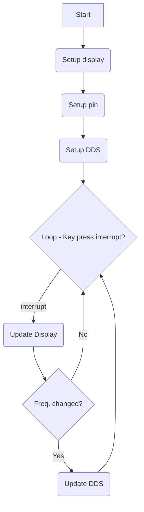
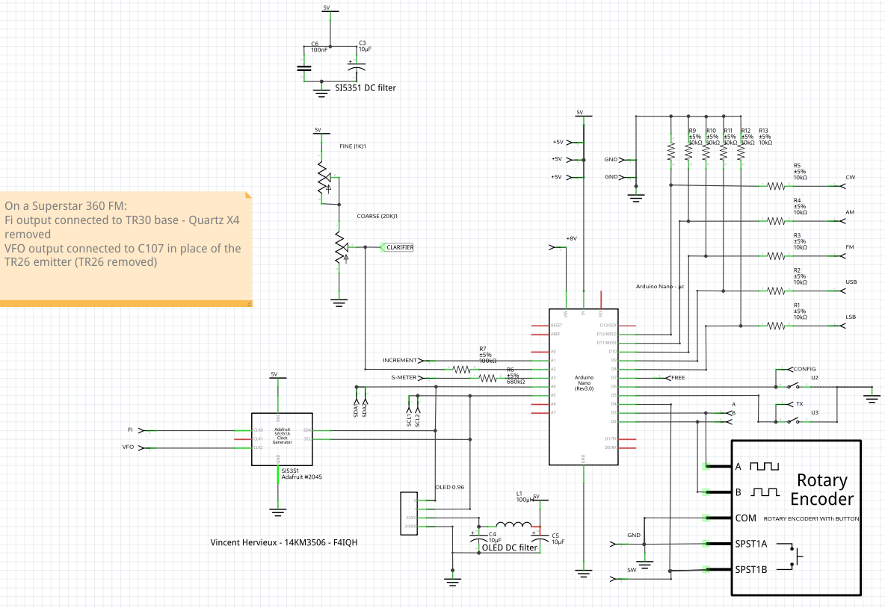
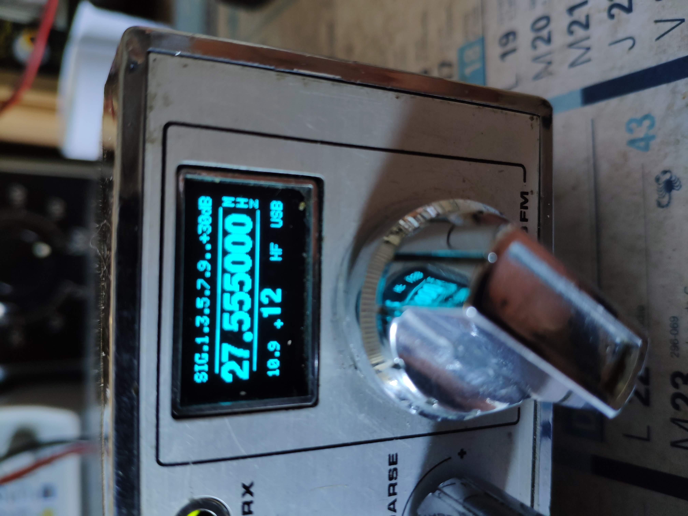
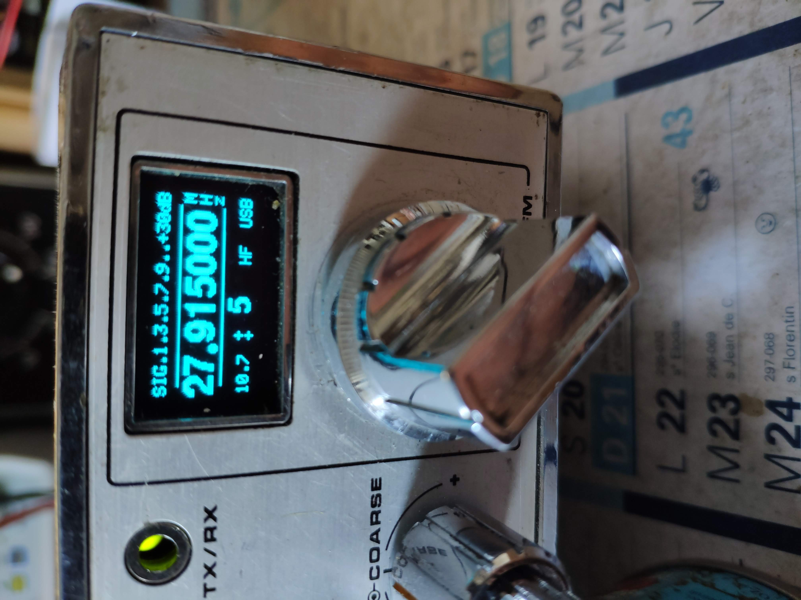
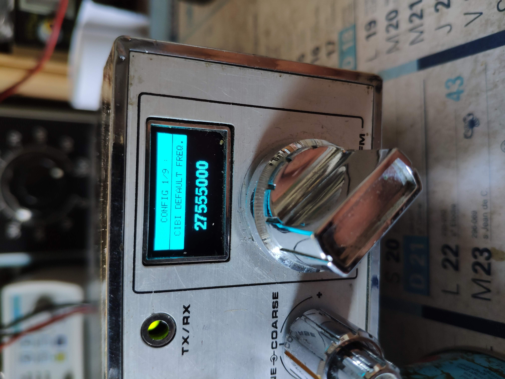
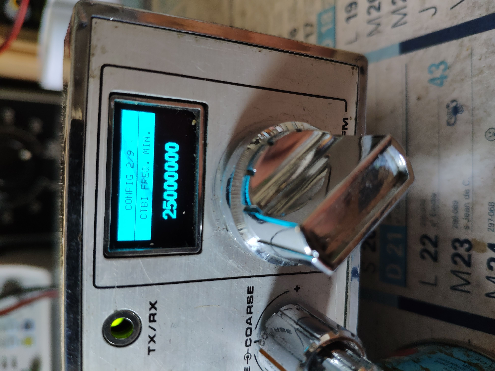
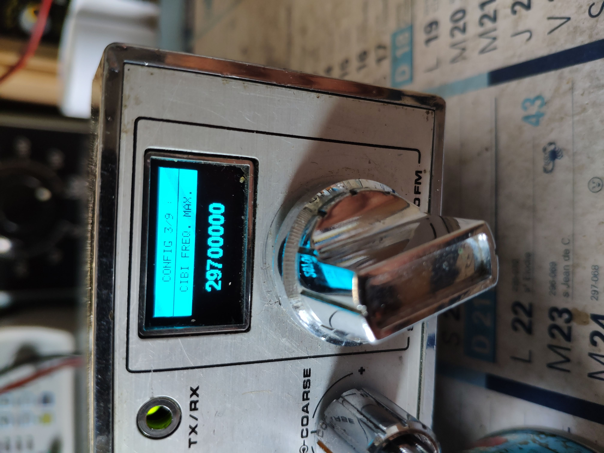
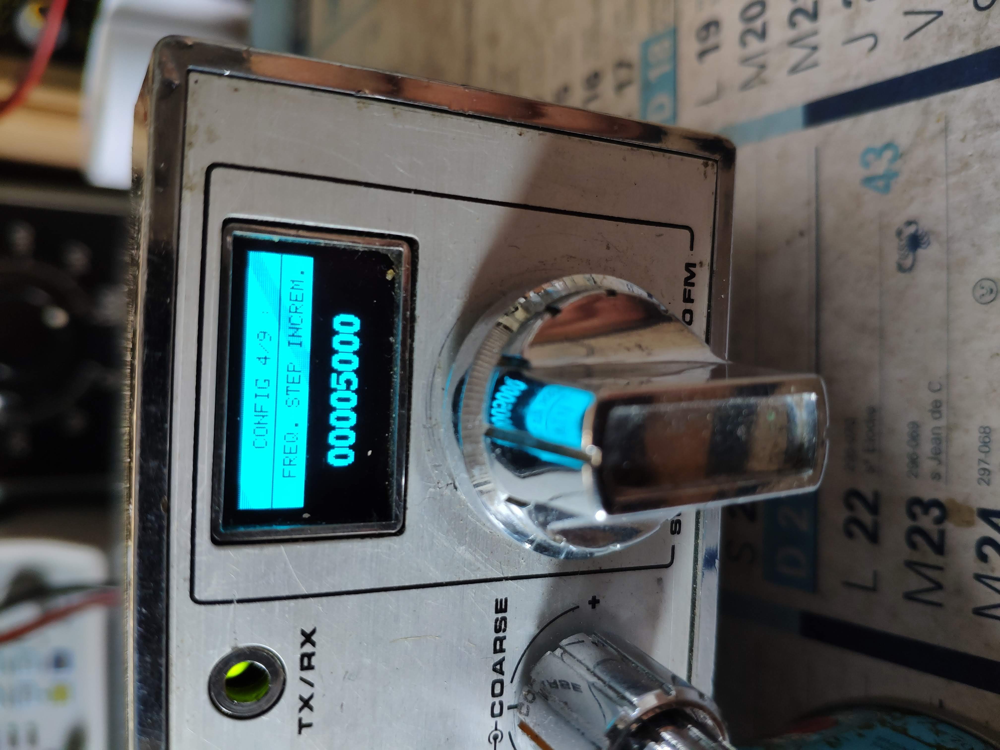
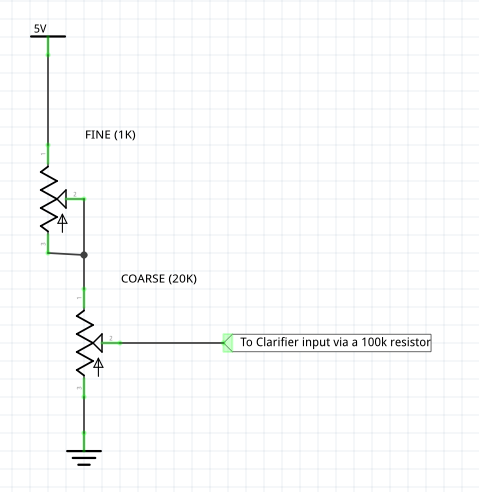

This Arduino code aims to drive a DDS and a Display in order to replace analog oscillators in old citizen band  transceivers.

# Parts
- [Arduino nano R3](doc/nano.png) with new bootloader (optiboot_atmega328.hex)
- OLED display SSD1306 128x64 0.96" IIC
- a Rotary encoder with button
- A DDS [si5351A](doc/Si5351-B.pdf) (3 outputs)

# Principles
## Basic principles
A rotary encoder with button is used.
- turning the encoder will adjust the frequency.
- clicking the encoder button will change the frequency step

Below it the working principle:

## Advanced explanations

- Modulation is read from the modulation selector and wired to D8, D9, D10, D11, D12 in order to adjust VFO and FI depending on the modulation type. This is mainly because of USB and LSB modes with are requiring +/- 2.5kHz shifts.
- TX is read from the mike plug on D5 to activate the FI oscillator upon TX only.
- The old band selector is re-used to switch between : 
* configuration mode (wired to D6).
* transverter mode (wired to D7) : TO BE DONE, for now tranceiver mode as below.
* tranceiver mode which is the default mode when neither D6 and D7 are selected
- finally a small S-meter is implemented using analog input A3
- a RX clarifier is built reusing front potentiometers
- an "increment" mode is built when setting 'CH9' on the front panel. In this tranceiver mode, step is always 5kHz, and pressing the rotary button performs a scan search. When a strong signal is found, the scan stops.

# Compilation

## Retrieve the source code using git

git clone git@gitlab.com:croutor/arduino-cibi-vfo.git

cd arduino-cibi-vfo

git submodule update --init --recursive

## Retrieve the source code without git

Download https://gitlab.com/croutor/arduino-cibi-vfo/-/archive/develop/arduino-cibi-vfo-develop.zip

Unzip it

Download https://github.com/pavelmc/Si5351mcu/archive/refs/heads/master.zip

Unzip it in arduino-cibi-vfo/lib/Si5351mcu 's folder

## IDE setup

This project is using [Microsoft Visual Studio Code](https://code.visualstudio.com/) with [PlatformIO IDE](https://platformio.org/platformio-ide)'s plugin.

## Building

Terminal -> Run Task ->PlatformIO: Build

## Upload on arduino

Terminal -> Run Task ->PlatformIO: Upload

# Wiring
Referring to [vfo.h](/include/vfo.h) and [input.cpp](/src/input.cpp):
* D12 = INPUT CW (active high or low depending on compilation flag INPUT_MODULATION_ACTIVE_HIGH)
* D11 = INPUT AM (active high or low depending on compilation flag INPUT_MODULATION_ACTIVE_HIGH)
* D10 = INPUT FM (active high or low depending on compilation flag INPUT_MODULATION_ACTIVE_HIGH)
* D9 = INPUT USB (active high or low depending on compilation flag INPUT_MODULATION_ACTIVE_HIGH)
* D8 = INPUT LSB (active high or low depending on compilation flag INPUT_MODULATION_ACTIVE_HIGH)
* D7 = (Unused) TRANSVERT MENU (active low)
* D6 = CONFIG MENU (active low)
* D5 = TX (active low)
* D4 = button pin (active low)
* D3 = Rotary encoder A pin
* D2 = Rotary encoder B pin
* A1 = Step/increment mode (active low)
* A2 = clarifier input (analog 0-5V)
* A3 = s-meter input (analog 0-5V)
* A4 = IIC SDA
* A5 = IIC SCL

DDS output on si5351:
* FI(10.695MHz+/-2.5kHz) = CLK0
* VFO(var) = CLK2

# Display
Main menu:

Main menu step frequencies:

Main menu changing frequencies by digit:https://code.visualstudio.com/

Configuration menu aims to adjust some user settings / adjustements:
 
 
 
 https://github.com/pavelmc/Si5351mcu/archive/refs/heads/master.zip

# Demo

Video explaining the project

# Integration in a Superstar 360 FM

C107 is unplugged from the TR26 emitter first. And then the DDS VFO output is connected to the base of TR27 via the C107 capacitor.

The X4 quartz (10.695MHz) is removed and the DDS FI output is connected to the base of TR30 via an additionnal 10pF capacitor.

TX input has to be connected to the pin of the microphone plug which is grounded while transmitting.

Increment input is connected to the CH9 switch.

Band selector is diconnected from the main board. Its center is grounded. Config's in put is connected to B and Transvert's input is connected to C.

Note that Transvert mode is UNUSED as it is not implemented, so finally you could also wire: Nothing on A, Config on B, and Increment on C.

S-meter input is connected on the Smeter (of course), on the S507 switch side.

Clarifier potentiometers (fine and coarse) are totally disconnected from the main board, and rewired as shown in the schematic

For the modulations, you need to connect D8, D9, D10, D11, D12 to the cibi tranceiver's modulation selector. Resistors bridges are protecting the inputs from the 8Volts.

# Credits

This project is using some external libraries:

- [U8G2 for the diplay](https://github.com/olikraus/u8g2)

- [Si5351mcu to Drive the DDS](https://github.com/pavelmc/Si5351mcu)

- [ClickEncoder for the rotary encoder](https://github.com/soligen2010/encoder)

- [TimerOne](https://playground.arduino.cc/Code/Timer1/)

